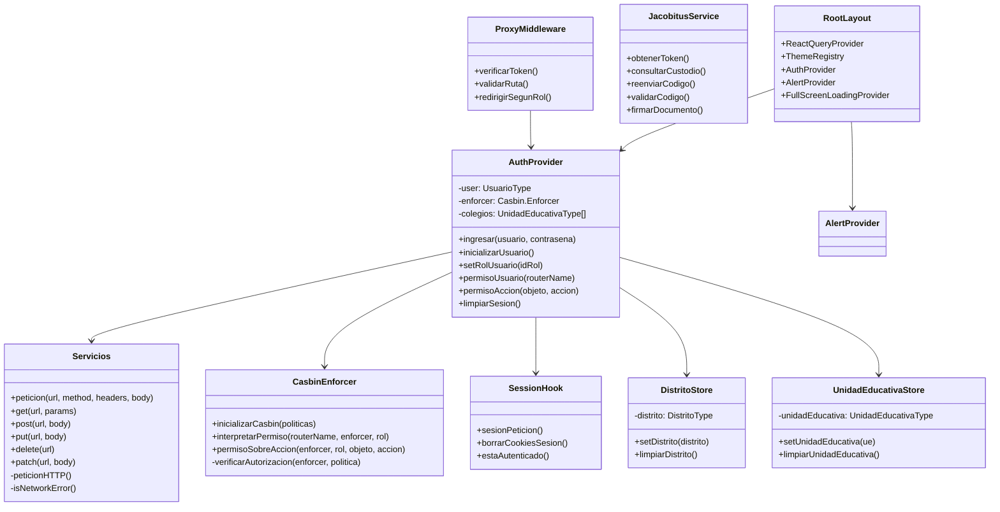
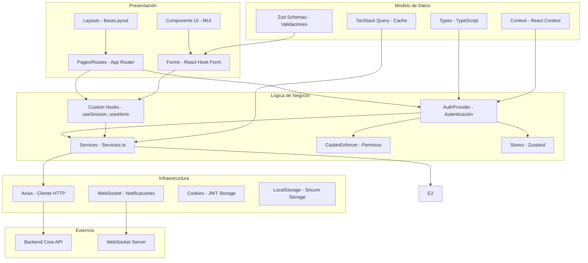
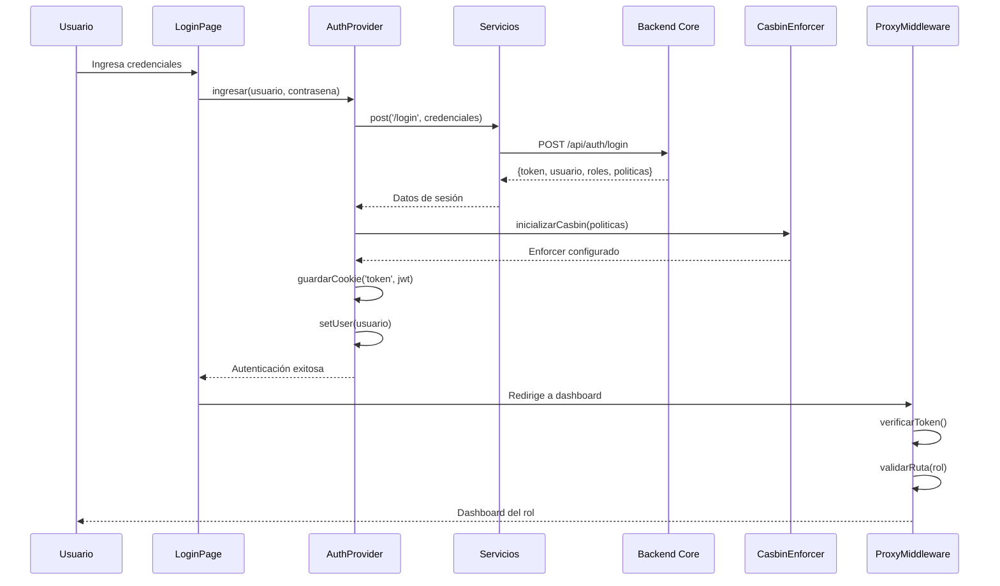
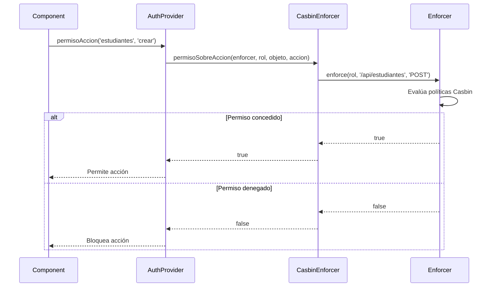
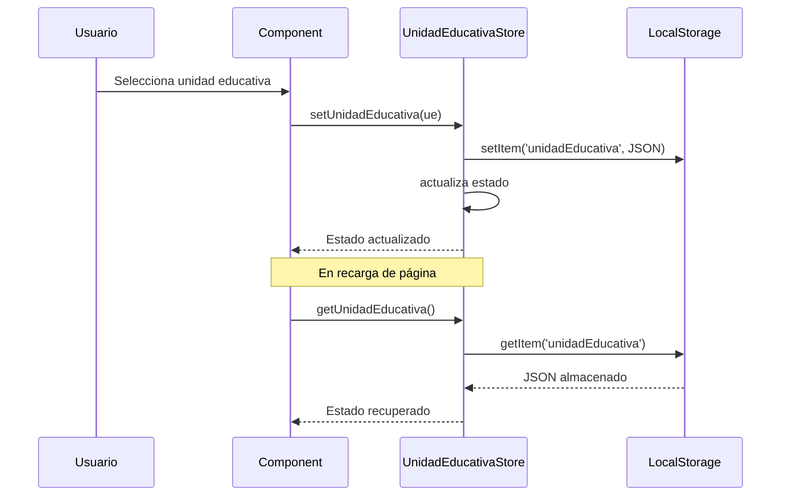
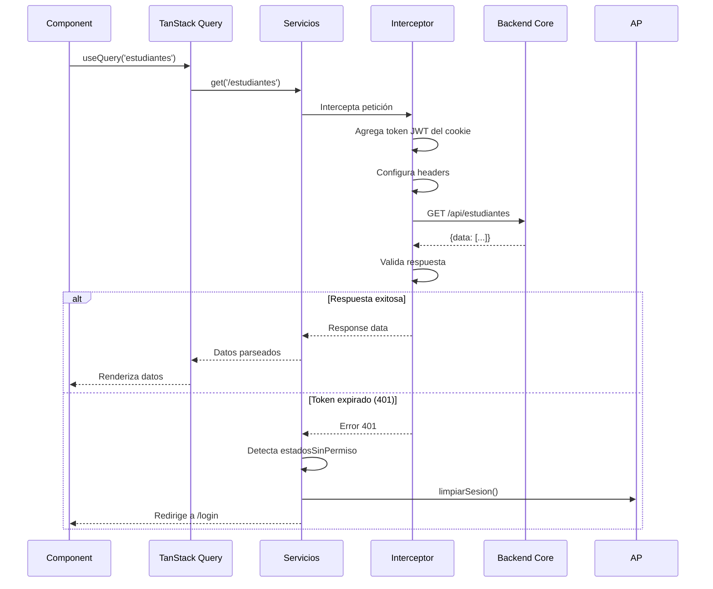
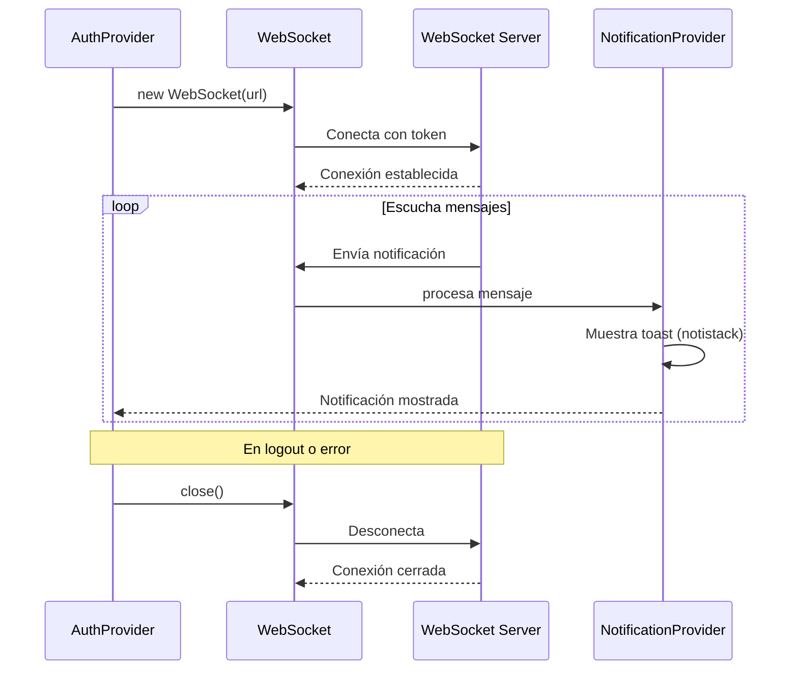
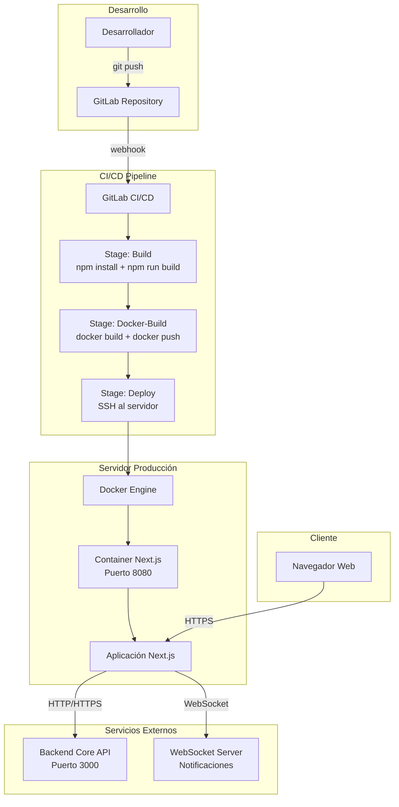

## 1. Introducción

- Aplicación web multirol con permisos granulares (RBAC con Casbin)
- Interfaz moderna con Material-UI v7 y tema claro/oscuro
- Integración con APIs REST del Backend Core
- Gestión de autenticación con JWT y cookies seguras
- Sistema de notificaciones en tiempo real con WebSockets

---
## 🚀 Características

- ⚡️ **Next.js 16** con App Router para un rendimiento óptimo
- 🎨 **Material-UI (MUI) v6** para componentes UI elegantes y responsivos
- 🌐 Cliente HTTP Axios para comunicación con el backend
- 🧪 Configuración de pruebas e2e con Playwright
- 🔍 SEO optimizado y rutas dinámicas

## 2. Requisitos Técnicos

### Software

| Componente | Mínimo | Recomendado |
|------------|--------|-------------|
| Node.js | 22.16.0 | 22.16.0 LTS |
| npm | 10.8.2 | 10.8.2+ |
| Docker | 24.0+ | 24.0+ (opcional) |
| OS | Ubuntu 20.04+, Debian 11+ | Ubuntu 22.04+, Debian 12+ |

### Frameworks y librerías principales

- **Next.js 16.0.2** - Framework React con App Router y SSR
- **React 19.2.0** - Librería UI reactiva
- **TypeScript 5.9.3** - Tipado estático
- **Material-UI (MUI) 7.3.5** - Sistema de componentes UI
- **@mui/x-data-grid 8.17.0** - Tablas avanzadas con paginación y ordenamiento
- **@mui/x-charts 8.17.0** - Gráficos y visualizaciones
- **React Hook Form 7.66.0** - Gestión de formularios
- **Zod 4.1.12** - Validación de esquemas
- **Axios 1.13.2** - Cliente HTTP
- **Casbin 5.41.0** - Control de acceso basado en roles (RBAC)
- **TanStack Query 5.90.8** - Estado de servidor y cache
- **Zustand 5.0.8** - Estado global ligero
- **Notistack 3.0.2** - Sistema de notificaciones toast
- **jwt-decode 4.0.0** - Decodificación de tokens JWT
- **dayjs 1.11.19** - Manejo de fechas
- **Playwright 1.56.1** - Testing E2E

---

## 3. Vista Lógica

## 📁 Estructura del proyecto

```
src/
├── app/                              # Rutas y páginas (App Router)
│   ├── layout.tsx                    # Layout raíz con providers
│   ├── (publico)/                    # Rutas públicas
│   │   └── portal/                   # Portal público
│   ├── login/                        # Autenticación
│   ├── admin/                        # Módulo administrador
│   │   ├── layout.tsx
│   │   ├── (configuracion)/          # Configuraciones del sistema
│   │   └── (principal)/              # Dashboard y funcionalidades principales
│   ├── director-ue/                  # Módulo Director de Unidad Educativa
│   │   ├── dashboard/
│   │   ├── paralelos/
│   │   └── perfil/
│   ├── director-departamental/       # Módulo Director Departamental
│   │   ├── dashboard/
│   │   ├── distritos/
│   │   ├── estudiantes/
│   │   └── unidadesEducativas/
│   ├── tecnico-legalizacion/         # Módulo Técnico de Legalización
│   ├── tecnico-distrital/            # Módulo Técnico Distrital
│   ├── responsable-legalizacion/     # Módulo Responsable de Legalización
│   └── api/                          # API Routes (middlewares internos)
│       └── estado/
├── components/                       # Componentes reutilizables
│   ├── layout/                       # Layouts (BaseLayout, Sidebar, Navbar)
│   ├── datagrid/                     # DataGrid personalizados
│   ├── datatable/                    # Tablas con paginación
│   ├── form/                         # Componentes de formularios
│   ├── modales/                      # Diálogos y modales
│   ├── botones/                      # Botones personalizados
│   ├── estados/                      # Chips de estado
│   ├── progreso/                     # Indicadores de carga
│   ├── sidebar/                      # Navegación lateral
│   ├── navbars/                      # Barra de navegación superior
│   ├── dashboard/                    # Widgets de dashboard
│   ├── archivos/                     # Gestión de archivos
│   ├── bitacora/                     # Registro de actividades
│   └── utils/                        # Utilidades UI
├── context/                          # Context API de React
│   ├── AuthProvider.tsx              # Autenticación y autorización
│   ├── AlertProvider.tsx             # Sistema de alertas
│   ├── FullScreenLoadingProvider.tsx # Loading global
│   ├── SideBarProvider.tsx           # Estado del sidebar
│   ├── PeriodosProvider.tsx          # Gestión de periodos académicos
│   └── ReactQueryProvider.tsx        # Configuración TanStack Query
├── features/                         # Módulos de funcionalidades específicas
│   ├── estudiantes/                  # Gestión de estudiantes
│   ├── bandejasEstudiantes/          # Bandejas de trabajo
│   ├── jerarquicasTablas/            # Tablas jerárquicas
│   └── perfil/                       # Perfil de usuario
├── hooks/                            # Hooks personalizados
│   ├── useSession.ts                 # Gestión de sesión y cookies
│   ├── useAlerts.tsx                 # Alertas y notificaciones
│   ├── useCasbinEnforcer.ts          # Permisos con Casbin
│   ├── useNotificaciones.ts          # Notificaciones en tiempo real
│   ├── useFirmaSocketMulti.ts        # WebSocket para firmas
│   ├── useStorage.ts                 # LocalStorage encriptado
│   └── usePublicRequest.ts           # Peticiones públicas sin auth
├── services/                         # Servicios de comunicación
│   ├── Servicios.ts                  # Cliente HTTP base (Axios)
│   ├── jacobitusService.ts           # Integración con Jacobitus
│   └── index.ts
├── store/                            # Estado global (Zustand)
│   ├── distritoStore.ts              # Estado de distrito seleccionado
│   └── unidadEducativaStore.ts       # Estado de UE seleccionada
├── config/                           # Configuraciones
│   ├── Constantes.ts                 # Variables de entorno
│   ├── ConstantesRoles.ts            # Definición de roles del sistema
│   ├── ConstantesBandejas.ts         # Estados de bandejas
│   └── RutasPorRol.ts                # Mapeo de rutas por rol
├── types/                            # Tipos TypeScript
│   ├── index.ts
│   ├── casbinTypes.ts                # Tipos para permisos
│   ├── dashboardTypes.ts             # Tipos de dashboard
│   ├── datatableTypes.ts             # Tipos de tablas
│   ├── fileType.ts                   # Tipos de archivos
│   ├── jacobitusType.ts              # Tipos de Jacobitus
│   ├── storeTypes.ts                 # Tipos de stores
│   └── theme.d.ts                    # Extensiones de tema MUI
├── utils/                            # Utilidades
│   ├── index.ts
│   ├── cookies.ts                    # Gestión de cookies
│   ├── token.ts                      # Manejo de JWT
│   ├── fechas.ts                     # Utilidades de fechas
│   ├── casbin.ts                     # Configuración Casbin
│   ├── interpreteMensajes.ts         # Mensajes de error
│   ├── secureStorage.ts              # LocalStorage encriptado
│   ├── validations.ts                # Validaciones comunes
│   ├── archivos.ts                   # Gestión de archivos
│   ├── imprimir.ts                   # Debug console
│   ├── utilidades.ts                 # Helpers generales
│   └── server/                       # Utilidades server-side
├── themes/                           # Temas de Material-UI
│   ├── ThemeRegistry.tsx             # Provider de temas
│   ├── light-theme.ts                # Tema claro
│   ├── dark-theme.ts                 # Tema oscuro
│   └── font.css                      # Fuentes personalizadas
├── proxy.ts                          # Middleware de Next.js (autenticación)
└── test/                             # Tests E2E con Playwright
    └── e2e/
```

### Diagrama de clases principal



### Modelo Vista Controlador (MVC)



---

## 4. Diagramas de Secuencia y Algoritmos

### Flujo de autenticación



### Verificación de permisos (RBAC con Casbin)



### Gestión de estado de unidad educativa



### Comunicación con Backend Core



### Notificaciones en tiempo real (WebSocket)



---

## 5. Configuración (Variables de Entorno)

### Archivo .env

```env
# Entorno de ejecución
NEXT_PUBLIC_APP_ENV=development                    # development | test | production

# Información de la aplicación
NEXT_PUBLIC_SITE_NAME="Sistema de Diplomas"       # Nombre de la aplicación

# Backend Core API
NEXT_PUBLIC_BASE_URL=http://localhost:3000/api    # URL base del Backend Core
NEXT_PUBLIC_PATH=                                  # Path base de la aplicación (opcional)

# Jacobitus API (Sistema de firmas)
NEXT_PUBLIC_API_JACUIBITUS=http://localhost:4000  # URL de Jacobitus

# WebSocket (Notificaciones en tiempo real)
NEXT_PUBLIC_SOCKET_URL=ws://localhost:3000/ws     # URL del WebSocket Server

# Google reCAPTCHA (Login)
NEXT_PUBLIC_SITE_KEY_RECAPTCHA=your_site_key      # Site key de reCAPTCHA v3

# Encriptación de LocalStorage
NEXT_PUBLIC_SECRET_KEY_SECURE=KEY_SECURE          # Clave para encriptar datos en localStorage

# Imágenes externas (Next.js Image Optimization)
NEXT_PUBLIC_IMAGES_DOMAIN=localhost,100.0.102.147 # Dominios permitidos para imágenes
```

### next.config.js - Configuración principal

```javascript
/** @type {import("next").NextConfig} */
const nextConfig = {
  // Path base de la aplicación (ej: /diplomas)
  basePath: process.env.NEXT_PUBLIC_PATH 
    ? '/' + process.env.NEXT_PUBLIC_PATH 
    : undefined,
  
  // Strict mode desactivado por renderizado doble en desarrollo
  reactStrictMode: false,
  
  // Oculta header X-Powered-By
  poweredByHeader: false,
  
  // Configuración Webpack para compatibilidad
  webpack: (config, context) => {
    if (!context.isServer) {
      config.resolve.fallback.child_process = false
      config.resolve.fallback = {
        ...config.resolve.fallback,
        fs: false,
      }
    }
    return config
  },
  
  // Output standalone para Docker
  output: 'standalone',
  
  // Optimización de imágenes externas
  images: {
    remotePatterns: process.env.NEXT_PUBLIC_IMAGES_DOMAIN
      ? process.env.NEXT_PUBLIC_IMAGES_DOMAIN.split(',')
          .flatMap((domain) => [
            { protocol: 'http', hostname: domain, pathname: '**' },
            { protocol: 'https', hostname: domain, pathname: '**' },
          ])
      : [],
  },
}

module.exports = nextConfig
```

### Middleware de autenticación (proxy.ts)

```typescript
// Mapeo de rutas protegidas por rol
const roleRoutes: Record<string, string[]> = {
  '/admin': ['ADMINISTRADOR'],
  '/director-ue': ['DIR'],
  '/tecnico-legalizacion': ['TECSDE'],
  '/tecnico-distrital': ['TECSDI'],
  '/responsable-legalizacion': ['RESLEG'],
  '/director-departamental': ['DDEP'],
}

// Ruta por defecto para cada rol
const roleDefaultPath: Record<string, string> = {
  ADMINISTRADOR: '/admin/home',
  DIR: '/director-ue/dashboard',
  TECSDE: '/tecnico-legalizacion/dashboard',
  TECSDI: '/tecnico-distrital/dashboard',
  RESLEG: '/responsable-legalizacion/dashboard',
  DDEP: '/director-departamental/dashboard',
}
```

### Servicios HTTP - Configuración de Axios

```typescript
// Estados HTTP considerados exitosos
export const estadosCorrectos: number[] = [200, 201, 202, 204]

// Estados que requieren re-autenticación
export const estadosSinPermiso: number[] = [401]

// Timeout por defecto
timeout: 60000  // 60 segundos

// Validación de status HTTP
validateStatus(status) {
  return estadosCorrectos.some((estado) => status === estado)
}

// Cookies habilitadas por defecto
withCredentials: true
```

---

## 6. Roles y Permisos del Sistema

### Roles disponibles

| Código | Nombre | Descripción |
|--------|--------|-------------|
| `ADMINISTRADOR` | Administrador | Acceso completo al sistema |
| `DIR` | Director de Unidad Educativa | Gestiona su unidad educativa |
| `DDEP` | Director Departamental | Supervisa unidades educativas departamentales |
| `TECSDE` | Técnico de Legalización | Legaliza documentos y diplomas |
| `TECSDI` | Técnico Distrital | Gestiona distrito educativo |
| `RESLEG` | Responsable de Legalización | Coordina proceso de legalización |

### Sistema de permisos con Casbin

El sistema utiliza **Casbin** para control de acceso basado en roles (RBAC):

```typescript
// Modelo Casbin
[request_definition]
r = sub, obj, act

[policy_definition]
p = sub, obj, act

[policy_effect]
e = some(where (p.eft == allow))

[matchers]
m = (r.sub == p.sub || p.sub == "*") && keyMatch2(r.obj, p.obj) && regexMatch(r.act, p.act)
```

**Ejemplo de políticas:**

```typescript
// Administrador tiene acceso completo
['ADMINISTRADOR', '/api/*', '(GET|POST|PUT|DELETE|PATCH)']

// Director UE solo puede ver y editar su unidad educativa
['DIR', '/api/unidades-educativas/:id', '(GET|PUT)']

// Técnico de legalización puede legalizar documentos
['TECSDE', '/api/documentos/legalizar', 'POST']
```

---

## 7. Vista de Despliegue

### Arquitectura de despliegue



### Dockerfile - Multi-stage build

```dockerfile
# Etapa 1: Build
FROM node:22.16.0 as builder

WORKDIR /app

# Instalar dependencias
COPY package*.json ./
RUN npm install

# Compilar aplicación
COPY . .
RUN npm run build

# Etapa 2: Producción
FROM node:22.16.0

WORKDIR /app

# Solo dependencias de producción
COPY package*.json ./
RUN npm pkg delete scripts.prepare
RUN npm install --only=production

# Copiar build y assets
COPY --from=builder /app/.next .next
COPY --from=builder /app/public public

EXPOSE 8080

CMD ["npm", "run", "start"]
```

### Docker Compose

```yaml
services:
  app:
    image: ${IMAGE_NAME}
    container_name: ${CONTAINER_NAME}
    restart: always
    ports:
      - "${HOST_PORT}:${CONTAINER_PORT}"
    environment:
      - NEXT_PUBLIC_APP_ENV=production
      - NEXT_PUBLIC_BASE_URL=${BACKEND_URL}
      - NEXT_PUBLIC_SOCKET_URL=${WEBSOCKET_URL}
    networks:
      - diplomas-network

networks:
  diplomas-network:
    external: true
```

### Pipeline de CI/CD

```yaml
stages:
  - build
  - docker-build
  - deploy

build:
  stage: build
  script:
    - npm install
    - npm run build
    - npm run lint
  artifacts:
    paths:
      - .next/
      - node_modules/

docker-build:
  stage: docker-build
  script:
    - docker build -t $IMAGE_NAME:$CI_COMMIT_SHA .
    - docker tag $IMAGE_NAME:$CI_COMMIT_SHA $IMAGE_NAME:latest
    - docker push $IMAGE_NAME:$CI_COMMIT_SHA
    - docker push $IMAGE_NAME:latest
  only:
    - main
    - develop

deploy:
  stage: deploy
  script:
    - ssh $SERVER_USER@$SERVER_HOST "cd /app && docker-compose pull && docker-compose up -d"
  only:
    - main
```

---

## 8. Patrones de Diseño Implementados

### 8.1 Provider Pattern (Context API)

**Problema**: Compartir estado global sin prop drilling

**Solución**: Uso de React Context para autenticación, alertas, loading, etc.

```typescript
// AuthProvider encapsula toda la lógica de autenticación
<AuthProvider>
  <AlertProvider>
    <FullScreenLoadingProvider>
      {children}
    </FullScreenLoadingProvider>
  </AlertProvider>
</AuthProvider>
```

### 8.2 Custom Hooks Pattern

**Problema**: Reutilizar lógica entre componentes

**Solución**: Hooks personalizados como `useSession`, `useAlerts`, `useCasbinEnforcer`

```typescript
// Encapsula lógica de sesión
const { sesionPeticion, borrarCookiesSesion } = useSession()

// Encapsula lógica de permisos
const { permisoAccion } = useCasbinEnforcer()
```

### 8.3 Repository Pattern (Services)

**Problema**: Centralizar comunicación con APIs

**Solución**: Clase `Servicios` como capa de abstracción sobre Axios

```typescript
class ServiciosClass {
  async peticion<T>({ url, method, body }) { /* ... */ }
  async get<T>({ url, params }) { /* ... */ }
  async post<T>({ url, body }) { /* ... */ }
}
```

### 8.4 Middleware Pattern (Next.js)

**Problema**: Validar autenticación y roles en cada ruta

**Solución**: Middleware de Next.js (`proxy.ts`) intercepta todas las peticiones

```typescript
export const proxy = (req: NextRequest) => {
  // Valida token JWT
  // Verifica rol vs ruta solicitada
  // Redirige si no tiene permisos
}
```

### 8.5 State Management - Zustand

**Problema**: Estado global sin complejidad de Redux

**Solución**: Stores ligeros con Zustand

```typescript
export const useDistritoStore = create<DistritoStore>((set) => ({
  distrito: null,
  setDistrito: (distrito) => set({ distrito }),
  limpiarDistrito: () => set({ distrito: null }),
}))
```

### 8.6 Component Composition

**Problema**: Componentes reutilizables y flexibles

**Solución**: Composición de componentes MUI con props personalizadas

```typescript
<CustomDataGrid
  rows={data}
  columns={columns}
  acciones={[
    { icono: 'edit', accion: handleEdit },
    { icono: 'delete', accion: handleDelete }
  ]}
/>
```

---

## 9. Seguridad

### 9.1 Autenticación

- **JWT almacenado en cookies HTTP-only** (no accesible desde JavaScript)
- **Token decodificado solo para leer claims** (rol, exp, usuario)
- **Validación de expiración** en middleware y provider

### 9.2 Autorización

- **Control de acceso basado en roles (RBAC)** con Casbin
- **Políticas granulares** por ruta y método HTTP
- **Validación en cliente y servidor**

### 9.3 Comunicación

- **HTTPS en producción** (configurado en servidor web)
- **Cookies con flag `secure`** en producción
- **WebSocket con autenticación** vía token

### 9.4 Almacenamiento

- **LocalStorage encriptado** (usando `crypto-js`)
- **No almacenar datos sensibles** en plain text
- **Limpiar storage al cerrar sesión**

### 9.5 Validación de datos

- **Zod schemas** para validación de formularios
- **React Hook Form** para manejo de estado de formularios
- **Sanitización de inputs** antes de enviar al backend

---

## 10. Scripts NPM

| Comando | Descripción |
|---------|-------------|
| `npm run dev` | Inicia servidor de desarrollo (puerto 8080) |
| `npm run build` | Compila la aplicación para producción |
| `npm run start` | Inicia servidor de producción |
| `npm run lint` | Ejecuta ESLint |
| `npm run format` | Formatea código con Prettier |
| `npm run format-check` | Verifica formato sin modificar |
| `npm run test:e2e` | Ejecuta pruebas E2E con Playwright |
| `npm run release` | Genera nueva versión (commit-and-tag-version) |

---

## 11. Estructura de Datos Clave

### Usuario

```typescript
interface UsuarioType {
  id: string
  usuario: string
  nombres: string
  apellidos: string
  email: string
  estado: EstadoUsuarioType
  idRol: string  // Rol activo actual
  roles: RoleType[]  // Todos los roles del usuario
}
```

### Rol

```typescript
interface RoleType {
  idRol: string
  nombre: string  // 'ADMINISTRADOR', 'DIR', etc.
  descripcion: string
  politicas: PoliticaType[]
}
```

### Política (Casbin)

```typescript
interface PoliticaType {
  sujeto: string   // Rol: 'ADMINISTRADOR'
  objeto: string   // Recurso: '/api/estudiantes'
  accion: string   // Método: 'GET|POST'
}
```

### Unidad Educativa

```typescript
interface UnidadEducativaType {
  id: string
  codigoRue: string
  nombre: string
  distrito: DistritoType
  departamento: DepartamentoType
  nivel: NivelEducativoType
  turnos: TurnoType[]
}
```

---

## 12. Integración con Servicios Externos

### Backend Core

- **URL Base**: Configurada en `NEXT_PUBLIC_BASE_URL`
- **Autenticación**: JWT en cookie, enviado automáticamente
- **Endpoints principales**:
  - `/api/auth/login` - Autenticación
  - `/api/usuarios` - Gestión de usuarios
  - `/api/estudiantes` - Gestión de estudiantes
  - `/api/diplomas` - Generación y consulta de diplomas
  - `/api/unidades-educativas` - Información de colegios


### WebSocket Server (Notificaciones)

- **URL**: Configurada en `NEXT_PUBLIC_SOCKET_URL`
- **Protocolo**: WebSocket
- **Autenticación**: Token JWT en conexión inicial
- **Eventos**: Notificaciones de cambios de estado, alertas del sistema

---
