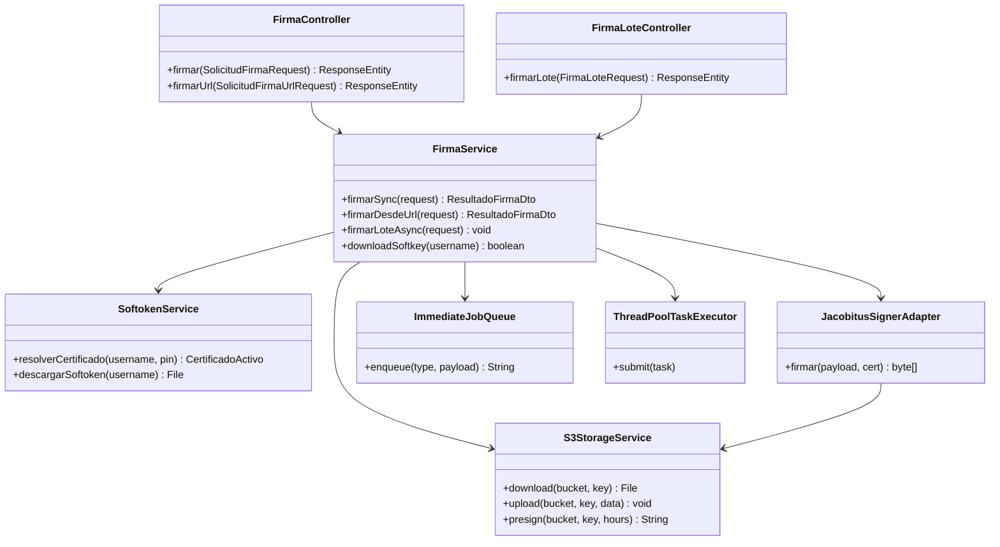
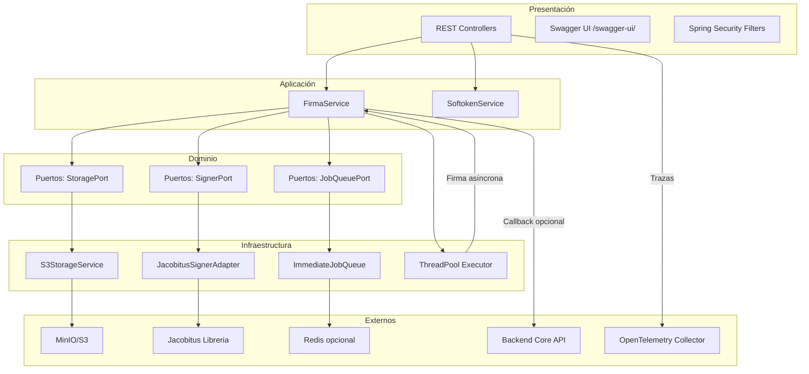
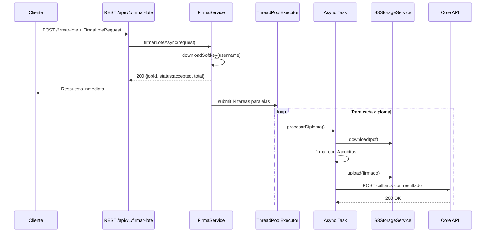
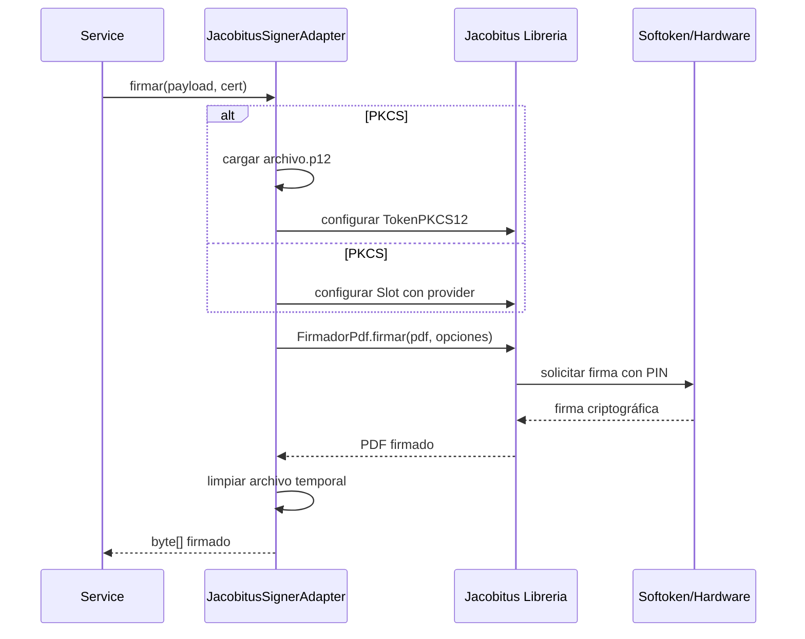
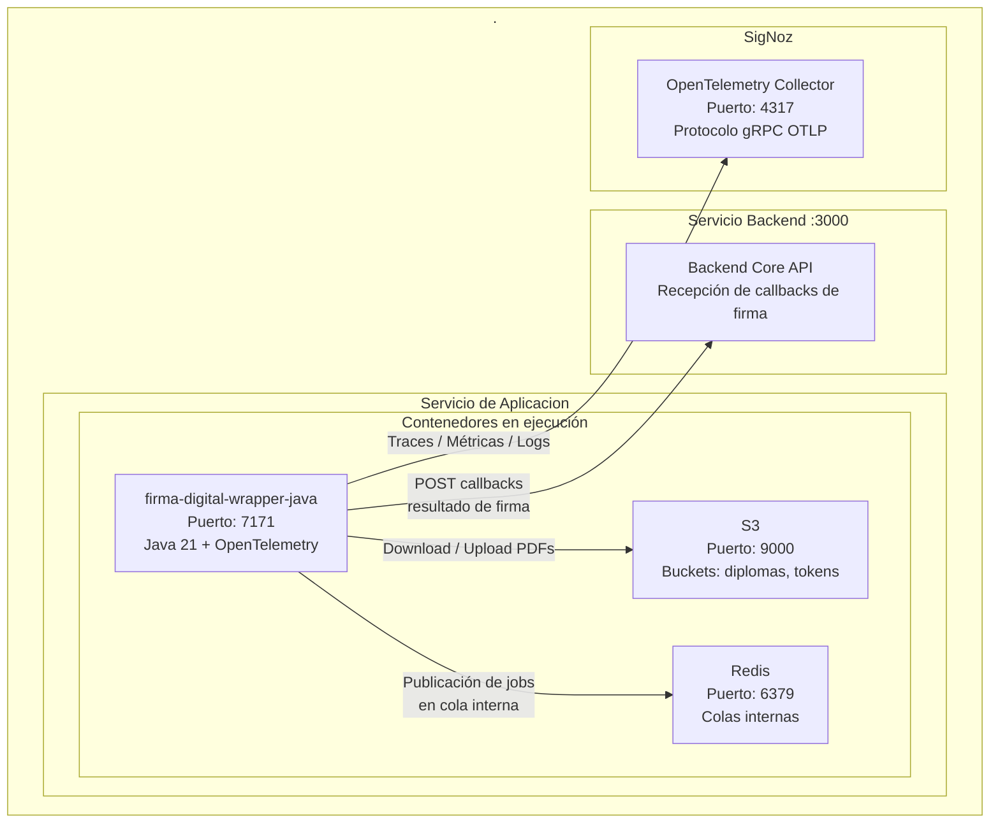
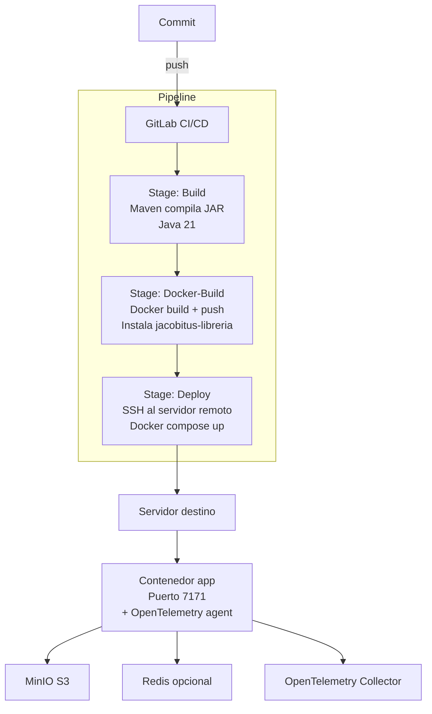
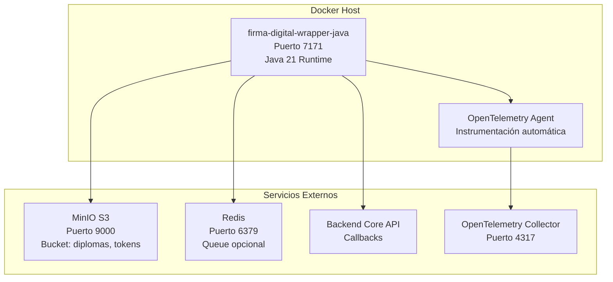

# Implementacion de la firma digital

## 1. Introducción

Este servicio ofrece:

- Firma digital **síncrona** de documentos PDF alojados en bucket S3
- Firma de archivos remotos descargados desde el Storage
- Firma **masiva en lote**
- Descarga automática del softoken desde el bucket tokens por usuario
---

## 2. Requisitos Técnicos

### Software

| Componente | Mínimo | Recomendado |
|------------|--------|-------------|
| Java | 17 | 21 |
| Maven | 3.9.x | 3.9.10+ |
| Spring Boot | 3.5.x | 3.5.3 |
| Redis | 7.0+ | 7.2+ (opcional) |
| MinIO/S3 | Compatible S3 | MinIO latest |
| Docker | 24.0+ | 24.0+ |
| OS | Ubuntu 24.04+, Debian 13 | Ubuntu 24.04+, Debian 13 |

### Frameworks y dependencias principales

- **Spring Boot 3.5.3** (Web, Validation, Security, Data Redis, Actuator)
- **AWS SDK v2** (S3 AsyncClient, S3 Transfer Manager) 2.38.3
- **Jacobitus Libreria** 1.2.1 (Firma digital PKCS#11/PKCS#12)
- **SpringDoc OpenAPI** 2.8.14 (Documentación Swagger)
- **Lombok**
- **OpenTelemetry Java Agent**

---

## 3. Vista Lógica

### Estructura de paquetes

```
src/main/java/com/minedu/planificacion/firma/
├── FirmaJavaApplication.java       # Punto de entrada Spring Boot
├── application/                    # Casos de uso y DTOs
│   ├── dto/                        # Request/Response DTOs
│   │   ├── SolicitudFirmaRequest.java
│   │   ├── SolicitudFirmaUrlRequest.java
│   │   ├── FirmaLoteRequest.java
│   │   ├── DiplomaLoteRequest.java
│   │   └── ResultadoFirmaDto.java
│   └── services/                   # Interfaces de servicios
│       ├── FirmaService.java
│       └── impl/
│           └── FirmaServiceImpl.java
├── domain/                         # Modelos de dominio y puertos
│   ├── models/
│   │   ├── CertificadoActivo.java
│   │   ├── FirmaPayload.java
│   │   └── ResponseModel.java
│   └── ports/                      # Interfaces de adaptadores
│       ├── SignerPort.java
│       ├── StoragePort.java
│       └── JobQueuePort.java
├── infrastructure/                 # Adaptadores externos
│   ├── config/                     # Configuración Spring
│   │   ├── AppConfig.java
│   │   ├── AsyncConfig.java
│   │   ├── FirmaExecutorConfig.java
│   │   ├── OpenApiConfig.java
│   │   └── WebConfig.java
│   ├── jacobitus/
│   │   └── JacobitusSignerAdapter.java  # Integración con librería Jacobitus
│   ├── storage/
│   │   └── S3StorageService.java        # Cliente S3 async
│   ├── queue/
│   │   └── ImmediateJobQueue.java       # Queue stub (puede integrarse con Redis)
│   └── security/
│       └── filter/                      # Filtros de autenticación
└── presentation/                   # Controladores REST
    ├── controllers/
    │   ├── FirmaController.java         # Endpoints /firmar, /firmar-url
    │   ├── FirmaLoteController.java     # Endpoint /firmar-lote
    │   └── HealthController.java
    └── advice/
        └── GlobalExceptionHandler.java
```

### Diagrama de componentes



### Modelo de arquitectura



---

## 4. Diagramas de Secuencia y Algoritmos

### Proceso de firma en lote asíncrono



### Proceso de firma con Jacobitus



---

## 5. Vista de Despliegue

### 5.1 Diagrama de Infraestructura Física



### 5.2 Pipeline CI/CD GitLab



### Diagrama de contenedores



---

## 6. Configuración y Variables de Entorno

### Archivo `application.yml`

```yaml
server:
  port: 7171

spring:
  application:
    name: firma-java
  data:
    redis:
      host: 100.0.102.147
      port: 6379
      password: dgp123

app:
  token: TEST_TOKEN
  s3:
    endpoint: http://100.0.102.147:9000
    access-key: admintest
    secret-key: admintest
    bucket-name: diplomas
    region: us-east-1
  tokens:
    bucket: tokens
  jacobitus:
    provider-path: /usr/lib/x86_64-linux-gnu/pkcs11/opensc-pkcs11.so
    timeout-ms: 60000
    validation-enabled: true
    default-pin: 123456
  firma:
    lote:
      max-threads: 5        # Threads paralelos para firma en lote
      queue-capacity: 500   # Capacidad de cola
  backend:
    core-api: http://100.0.102.147:3000/api
    api-token: TEST_TOKEN
    timeout-ms: 30000
```

### Variables de entorno Docker

```bash
OTEL_SERVICE_NAME=firma-digital-wrapper-java
OTEL_EXPORTER_OTLP_ENDPOINT=http://10.8.0.4:4317
OTEL_LOGS_EXPORTER=otlp
OTEL_METRICS_EXPORTER=otlp
OTEL_TRACES_EXPORTER=otlp
```

---

## 7. Instalación y Ejecución

### 7.1 Requisitos previos

1. **Instalar librería Jacobitus en repositorio local Maven:**

```bash
./mvnw install:install-file \
  -Dfile=libs/jacobitus-libreria-1.2.1.jar \
  -DgroupId=bo.firmadigital.jacobitus \
  -DartifactId=jacobitus-libreria \
  -Dversion=1.2.1 \
  -Dpackaging=jar
```

2. **Configurar S3:**
   - Crear bucket `diplomas` para PDFs
   - Crear bucket `tokens` para softokens (.p12)

### 7.2 Compilación

```bash
# Compilar el proyecto
./mvnw clean package -DskipTests

# El JAR generado estará en:
# target/firma-java-0.0.1-SNAPSHOT.jar
```

### 7.3 Ejecución local

```bash
# Ejecutar la aplicación
java -jar target/firma-java-0.0.1-SNAPSHOT.jar

# O con Maven wrapper
./mvnw spring-boot:run
```

La aplicación estará disponible en `http://localhost:7171`

### 7.4 Despliegue con Docker

```bash
# Construir imagen
docker build -t firma-digital-wrapper-java .

# Ejecutar con docker-compose
cd docker
docker-compose up -d
```

---

## 8. API Endpoints

### 8.1 Documentación interactiva

- **Swagger UI:** `http://localhost:7171/swagger-ui/index.html`
- **OpenAPI JSON:** `http://localhost:7171/v3/api-docs`

### 8.2 Endpoints principales

#### POST `/api/v1/firmar` - Firma síncrona

**Request:**
#### POST `/api/v1/firmar-lote` - Firma masiva asíncrona

**Request:**
```json
{
  "jobId": "lote-123",
  "username": "usuario",
  "pin": "123456",
  "diplomas": [
    {
      "diplomaId": "DIP-001",
      "pdfPath": "lote/diploma1.pdf",
      "nombreArchivo": "diploma1.pdf"
    },
    {
      "diplomaId": "DIP-002",
      "pdfPath": "lote/diploma2.pdf",
      "nombreArchivo": "diploma2.pdf"
    }
  ]
}
```

**Response:**
```json
{
  "status": "accepted",
  "message": "Se recibieron 2 documentos para firma digital",
  "total": 2,
  "jobId": "lote-123"
}
```
---

## 9. Desarrollo

### 9.1 Estructura del código

- **Arquitectura hexagonal (Ports & Adapters)**
- **Inyección de dependencias con Spring**
- **Programación reactiva con S3 AsyncClient**
- **DTOs validados con Jakarta Validation**
- **Manejo global de excepciones**

### 9.2 Hot reload en desarrollo

```bash
./mvnw spring-boot:run

```

---

## 10. Observabilidad

### 10.1 Métricas y trazas

- **OpenTelemetry Java Agent** integrado en el contenedor
- Exporta trazas, logs y métricas vía OTLP/gRPC
- Endpoint configurado: `http://10.8.0.4:4317`

### 10.2 Logs

- **SLF4J 2.x + Logback** (por defecto en Spring Boot)
- Logs estructurados con contexto de operaciones
- Niveles configurables vía `application.yml`

### 10.3 Actuator endpoints

```bash
# Health
curl http://localhost:7171/actuator/health

# Info
curl http://localhost:7171/actuator/info
```

---

## 11. Troubleshooting

### Error: "No se pudo descargar el softtoken"

**Solución:** 
1. Verificar que el archivo `.p12` exista en el bucket `tokens`
2. Comprobar que el nombre de usuario coincida con el archivo (ej: `usuario.p12`)

### Error de conexión con S3

**Solución:**
1. Verificar credenciales en `application.yml`
2. Comprobar conectividad de red: `curl http://100.0.102.147:9000`
3. Validar que los buckets existan

### Firma lenta en lote

**Solución:** Aumentar el número de threads:

```yaml
app:
  firma:
    lote:
      max-threads: 10  # Aumentar según CPU disponible
```

---
