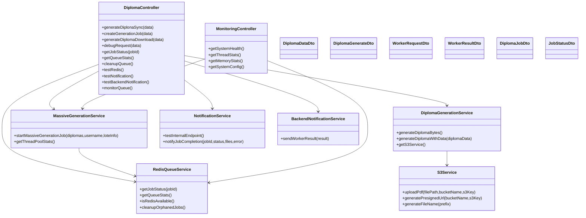
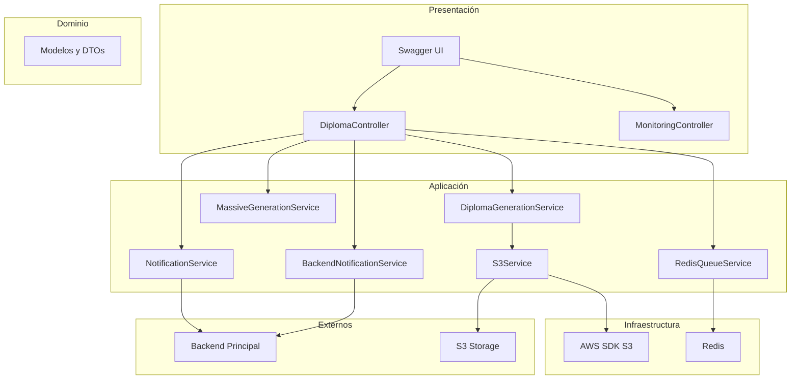
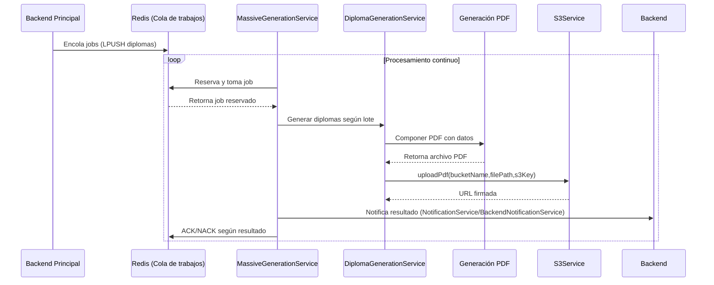
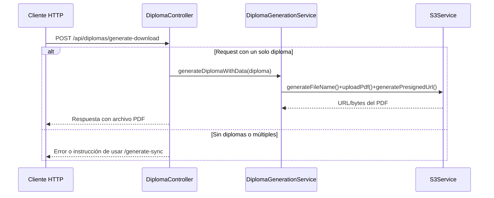
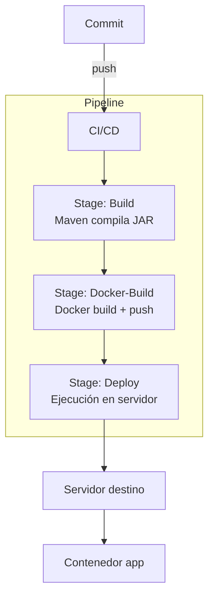

# Servicio de Generación de Diplomas
Aplicación Spring Boot para la generación y entrega de diplomas en PDF, con almacenamiento en Bucket RustFS (similar a S3) de código abierto y procesamiento asíncrono mediante Redis. Se integra con un backend principal para notificaciones y coordinación de trabajos masivos.

---
## 1. Introducción
- Generación de diplomas en formato PDF a partir de datos provistos por el backend principal.
- Almacenamiento en RustFS y obtención de URLs.
- Procesamiento asíncrono de lotes mediante colas en Redis.
- Endpoints de monitoreo de estado y recursos.
- Documentación automática con Swagger/OpenAPI.

---
## 2. Requisitos Técnicos
### Software
| Componente | Mínimo | Recomendado |
|------------|--------|-------------|
| Java | 21 | 21 LTS |
| Maven | 3.9+ | 3.9.6+ |
| Redis | 7.0+ | 7.2+ |
| S3 | Compatible AWS S3 | RustFS |
| Docker | 24.0+ | 24.0+ |
| OS | Ubuntu 22.04+ | Ubuntu 24.04+ |

### Frameworks y librerías
- Spring Boot 3.5.3
- Spring Web
- Spring Actuator
- Spring Data Redis
- Spring Integration Redis
- SpringDoc OpenAPI
- Apache PDFBox 2.0.29
- Apache Batik (transcoder/codec) 1.17
- AWS SDK v2 (S3)
- ZXing 3.5.1
- Jackson (JSON)
- Lombok / SLF4J + Logback

---
## 3. Arquitectura Lógica
### Paquetes principales
```
com.minedu.diplomas/
├── controller/           # Controladores REST (DiplomaController, MonitoringController)
├── service/              # Lógica de negocio y orquestación
│   ├── DiplomaGenerationService
│   ├── MassiveGenerationService
│   ├── RedisQueueService
│   ├── NotificationService
│   ├── BackendNotificationService
│   └── S3Service
├── config/               # Configuración (AppConfig, AsyncConfig, RedisConfig)
├── model/                # DTOs: DiplomaDataDto, WorkerRequestDto, WorkerResultDto, etc.
├── monitoring/           # Utilidades de monitoreo (ThreadPoolMonitor)
└── utils/                # Utilidades comunes (Utils)
```

### Flujo general
- Recepción de solicitudes HTTP para generar diplomas (individual o en lote).
- En modo lote, se crea un "job" y se encola para procesamiento asíncrono.
- Generación del PDF en memoria y publicación en RustFS.
- Notificación al backend principal con el resultado del trabajo.
- Monitoreo del estado del job y métricas del sistema mediante endpoints dedicados.

### Diagrama de clases


### Modelo Vista Controlador (MVC)


---
## 4. Endpoints
Base: `http://localhost:3100`

### Diplomas (`/api/diplomas`)
- `POST /generate-sync`: Inicia procesamiento masivo asíncrono. Responde `202 Accepted` con `jobId` y detalles.
- `POST /generate-async-job`: Variante enfocada a orquestación de jobs. Responde `202 Accepted` con `jobId`.
- `POST /generate-download`: Genera y descarga un diploma en PDF cuando el request contiene un único elemento; para múltiples, usar `/generate-sync`.
- `POST /debug-request`: Devuelve eco estructurado del payload para verificación.
- `GET /job-status/{jobId}`: Consulta el estado de un trabajo masivo (progreso, totales, timestamps, error si aplica).
- `GET /queue-stats`: Estadísticas de la cola y lista de procesamiento.
- `POST /queue-cleanup`: Limpia trabajos huérfanos en las estructuras de Redis.

### Monitoreo (`/api/monitoring`)
- `GET /health`: Estado general (thread pool, Redis, memoria, threads, timestamp).
- `GET /threads`: Estadísticas del pool de procesamiento.
- `GET /memory`: Uso de memoria de la JVM y estado (HEALTHY/WARNING/CRITICAL).
- `GET /config`: Resumen de configuración operativa y rutas relevantes.

### Swagger/OpenAPI
- UI: `http://localhost:3100/swagger-ui.html`

---
## 5. Configuración (`src/main/resources/application.properties`)
### Aplicación y servidor
```
spring.application.name=diploma-generator
server.port=3100
spring.devtools.livereload.enabled=true
springdoc.swagger-ui.path=/swagger-ui.html
logging.level.com.minedu.diplomas=DEBUG
```

### S3
```
s3.endpoint.url=http://100.0.102.147:9000
s3.access.key=admintest
s3.secret.key=admintest
s3.bucket.name=diplomas
s3.region=us-east-1
```

### Integración Backend
```
notification.backend.url=http://100.0.102.147:3000/api/worker
app.token=TEST_TOKEN
notification.backend.api-key=413F4428472B4B6250655368566D5970337336763979244226452948404D6351
notification.backend.internal-endpoint=http://100.0.102.147:3000/api/diplomas
backend.internal-endpoint=http://100.0.102.147:3000
```

### Verificación de diplomas
```
diploma.verification.endpoint=https://validar.firmadigital.gob.bo:3000/
```

### Redis
```
spring.data.redis.host=100.0.102.147
spring.data.redis.port=6379
spring.data.redis.password=dgp123
spring.data.redis.timeout=2000ms
```

### Procesamiento asíncrono
```
spring.task.execution.pool.core-size=8
spring.task.execution.pool.max-size=16
spring.task.execution.pool.queue-capacity=50
```
AsyncConfig.java
```java
// Threads base que siempre están disponibles
// Optimizado para procesamiento 100% asíncrono
executor.setCorePoolSize(8);

// Máximo de threads en picos de carga
// Maneja hasta 16 jobs simultáneos
executor.setMaxPoolSize(16);

// Tareas que esperan cuando todos los threads están ocupados
// Buffer amplio para múltiples requests
executor.setQueueCapacity(50);

// Prefijo para identificar threads en logs
executor.setThreadNamePrefix("diploma-async-");

/*
 * CONFIGURACIÓN ACTUAL (Procesamiento 100% Asíncrono):
 * - corePoolSize: 8
 * - maxPoolSize: 16
 * - queueCapacity: 50
 * 
 * MONITOREO DISPONIBLE:
 * - GET /api/diplomas/thread-monitor - Estadísticas en tiempo real del pool
 * - Logs automáticos al iniciar/completar jobs
 * 
 * MÉTRICAS CLAVE:
 * - activeCount: threads actualmente procesando
 * - queueSize: tareas esperando en cola
 * - utilizationPercent: % de uso del pool
 * - poolStatus: HEALTHY / BUSY / SATURATED
 * 
 * SEÑALES DE ALERTA:
 * - poolStatus = SATURATED (>80% utilización)
 * - queueSize cercano a queueCapacity
 * - Rechazos de tareas en logs
 * 
 * ESCALAMIENTO:
 * Si se observa saturación constante, aumentar:
 * - corePoolSize a 12-16
 * - maxPoolSize a 24-32
 * - queueCapacity a 100
 */
```

### Generación de diplomas
```
diploma.generation.sync-threshold=10000
worker.node.instance.denomination=worker-1
```

---
## 6. Colas y Jobs (Redis)
- Se utiliza una cola principal para trabajos de generación en lote.
- Los jobs contienen la lista de diplomas y metadatos del lote (`loteRequestInfo`).
- `RedisQueueService` provee:
  - Reserva y procesamiento de trabajos.
  - Estadísticas (`queueSize`, `processingSize`).
  - Limpieza de jobs huérfanos.
- `MassiveGenerationService` orquesta el procesamiento concurrente controlando el pool de threads.

---
## 7. Despliegue
### Dockerfile y Compose
- `Dockerfile`: Construye la imagen de la aplicación Spring Boot.
- `docker/docker-compose.yml`: Ejecuta el servicio con variables:
  - `IMAGE_NAME`, `CONTAINER_NAME`, `HOST_PORT`, `CONTAINER_PORT`.
  - Volúmenes: `./config` (solo lectura), `./static` (lectura/escritura), `./build`.
  - `JAVA_TOOL_OPTIONS=-Dloader.path=/app/config`.

### Ejemplos de comandos (Linux/zsh)
```zsh
# Construir JAR
./mvnw clean package -DskipTests

# Ejecutar localmente
java -jar target/diploma-batik-pdfbox-1.0.0.jar

# Construir imagen Docker
docker build -t diplomas-app:latest .

# Ejecutar con docker-compose (desde la carpeta docker/)
export IMAGE_NAME=diplomas-app:latest
export CONTAINER_NAME=diplomas-app
export HOST_PORT=3100
export CONTAINER_PORT=3100
cd docker
docker compose up -d
```

---
## 8. Diagramas de Secuencia y Algoritmos
### Procesamiento asíncrono (Worker)


### Generación síncrona de reportes individuales


---
## 9. Vista de Despliegue


---
## 8. Uso de la API
### Solicitud de generación masiva
`POST /api/diplomas/generate-sync`

Payload ejemplo (campos más relevantes):
```json
{
  "username": "usuario",
  "loteRequestInfo": {
    "descripcion": "Lote de diplomas",
    "codSieUe": 1
  },
  "diplomas": [
    {
      "nombreCompleto": "Estudiante Ejemplo",
      "departamento": "LA PAZ",
      "especialidad": "Informática"
    }
  ]
}
```
Respuesta `202 Accepted`:
```json
{
  "message": "Procesamiento iniciado de forma asíncrona",
  "jobId": "<ID>",
  "status": "PROCESSING",
  "totalDocuments": 1,
  "info": "Use /api/diplomas/job-status/<ID> para consultar el progreso"
}
```

### Consulta de estado
`GET /api/diplomas/job-status/{jobId}`
Retorna progreso, totales y timestamps del trabajo.

---
## 10. Monitoreo y Operación
- Actuator y endpoints de monitoreo para salud del sistema.
- Revisar `/api/monitoring/health` durante carga alta.
- Umbrales recomendados:
  - Memoria: `< 70%` saludable, `70–85%` advertencia, `> 85%` crítico.
  - Pool de threads: estados `HEALTHY`, `BUSY`, `SATURATED` según utilización.

---
## 11. Notas Operativas
- Toda generación en lote es asíncrona; las respuestas HTTP no bloquean.
- Para descargas individuales, usar `/generate-download`.
- Configurar credenciales S3 y Redis antes de ejecutar en producción.
- Asegurar conectividad hacia el backend principal para notificaciones.

