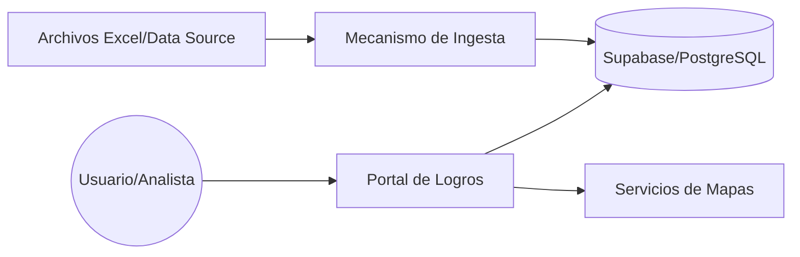
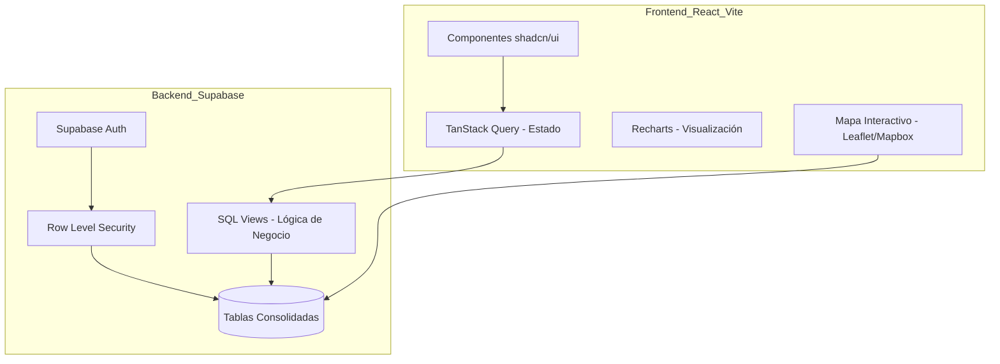
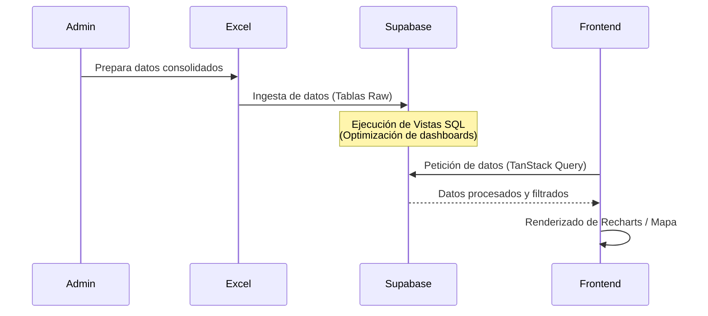

# Portal de Logros 

**Portal de Datos Estadísticos de Logros Educativos de Bolivia**

El Portal de Logros es una plataforma analítica avanzada diseñada para centralizar, visualizar y analizar el panorama educativo de Bolivia durante la última década. El sistema transforma datos complejos en conocimiento accionable mediante dashboards interactivos, mapas georeferenciados y análisis de inversión-impacto.

## 📊 Alcance y Clasificación de Datos

La información está estructurada de forma multidimensional, permitiendo un filtrado profundo por:
* **Geografía**: Gestión, departamento, provincia, municipio y distrito.
* **Entorno**: Áreas rurales o urbanas.
* **Dependencia**: Fiscal, privada o de convenio.
* **Demografía**: Clasificación por sexo y subsistemas (Regular o Alternativa).

## 🛠️ Módulos Funcionales

1. El portal consolida información crítica de los siguientes programas:
**Logros de Bachillerato**:
* **DBG**: Diplomas de bachillerato emitidos gratuitamente.
* **BTH**: Seguimiento de Bachillerato Técnico Humanístico.
* **IBD**: Incentivos otorgados a Bachilleres Destacados.

2. **Protección Social**: Cobertura y beneficiarios del Bono Juancito Pinto (BJP).

3. **Programas Nacionales de Alfabetización (PNP)**:
* Resultados de Alfabetización y Post-alfabetización.
* Comunidades de Lectura.
* Análisis de **Costos por Participante** e inversión total.

4. **Censo de Unidades Educativas (UE)**:
* Estado operativo (Abierta/Cerrada).
* Oferta de niveles (Inicial, Primaria, Secundaria y combinaciones).
* Ubicación precisa mediante coordenadas de latitud y longitud.

## 🏗️ Arquitectura del Sistema
**Diagrama de Contexto**
Muestra cómo interactúa el usuario y los orígenes de datos con el ecosistema de Educa Vision AI.


**Diagrama de Componentes**
Detalle de la estructura interna basada en el stack tecnológico.


**Diagrama de Secuencia: Ingesta y Visualización**
Proceso desde la carga de datos hasta la representación gráfica.


## 📈 Visualizaciones e Interactividad
El proyecto implementa una estrategia de visualización desacoplada mediante dashboards especializados:
* **Evolución de Impacto**: Gráficos de barras y líneas que comparan la evolución de graduados vs. inversión realizada específicamente para los programas PNP.
* **Mapa Interactivo de UEs**: Visualización geográfica de todas las unidades educativas del país. Incluye filtros dinámicos y tooltips con información detallada de cada sede (niveles, estado, ubicación).
* **Miscelánea de Dashboards**:

    * Resumen anual de diplomas, títulos técnicos e incentivos (IBD).
    * Distribución de género por categorías y gestión.
    * Ranking de especialidades técnicas (BTH).
    * Costo promedio de graduados por departamento para programas de alfabetización.

## 🛠️ Stack Tecnológico

El proyecto está construido utilizando tecnologías modernas de desarrollo web:

* **Core**: [React](https://react.dev/) (v18), [TypeScript](https://www.typescriptlang.org/)
* **Build Tool**: [Vite](https://vitejs.dev/)
* **Estilizado**: [Tailwind CSS](https://tailwindcss.com/)
* **Componentes UI**: [shadcn/ui](https://ui.shadcn.com/) (basado en Radix UI)
* **Visualización de Datos**: [Recharts](https://recharts.org/)
* **Enrutamiento**: [React Router](https://reactrouter.com/)
* **Gestión de Estado y Datos**: [TanStack Query](https://tanstack.com/query/latest)
* **Gestión de Formularios**: [React Hook Form](https://react-hook-form.com/) con validación [Zod](https://zod.dev/)
* **Backend y Base de Datos**: [Supabase](https://supabase.com/)

## 🔐 Esquema de Seguridad

La seguridad del aplicativo se gestiona a través de la infraestructura de Supabase:
* **Autenticación**: Gestión de usuarios y sesiones segura mediante Supabase Auth.
* **Protección de Datos**: Uso de Row Level Security (RLS) en PostgreSQL para asegurar que los usuarios solo accedan a la información permitida.
* **Variables de Entorno**: Configuración sensible manejada a través de archivos `.env`.

## 🚀 Instrucciones de Construcción y Despliegue

### Instalación y Desarrollo Local

1.  **Clonar el repositorio**:
    ```bash
    git clone <URL_DEL_REPOSITORIO>
    ```

2.  **Instalar dependencias**:
    Navega al directorio del proyecto e instala los paquetes necesarios.
    ```bash
    cd educa-vision-ai
    npm install
    ```

3.  **Configuración de Entorno**:
    Asegúrate de tener un archivo `.env` configurado con las credenciales necesarias (ej. `VITE_SUPABASE_URL`, `VITE_SUPABASE_ANON_KEY`).

4.  **Iniciar servidor de desarrollo**:
    ```bash
    npm run dev
    ```
    La aplicación estará disponible típicamente en `http://localhost:8080` o el puerto que indique la consola.

### Construcción para Producción

Para generar una build optimizada para producción:

```bash
npm run build
```

Este comando generará los archivos estáticos en la carpeta `dist`.

### Despliegue

El proyecto es una SPA (Single Page Application) estática, por lo que puede desplegarse fácilmente en proveedores como:
* [Lovelable](https://lovable.dev/)
* [Vercel](https://vercel.com/)
* [Netlify](https://netlify.com/)

Simplemente conecta tu repositorio y configura el comando de build (`npm run build`) y el directorio de salida (`dist`).
